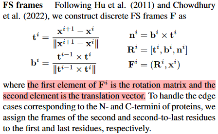
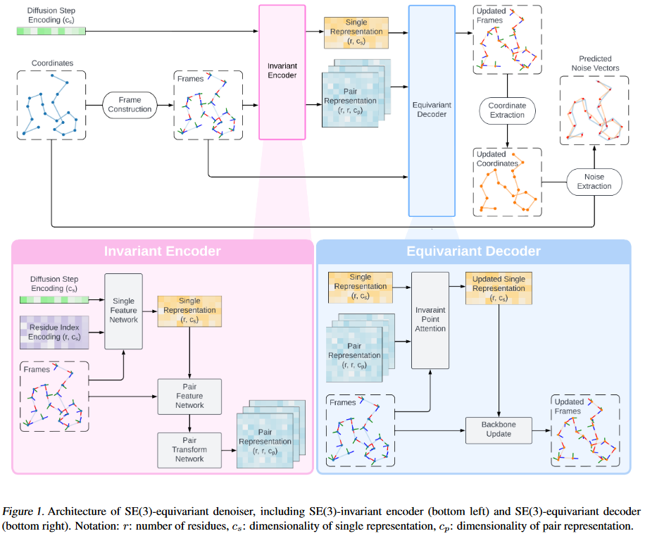
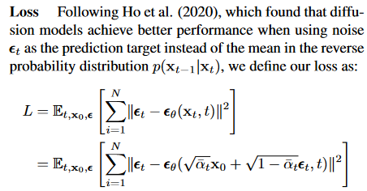
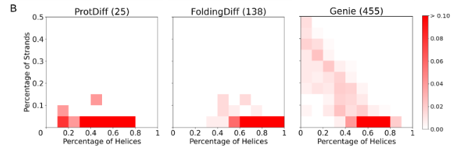
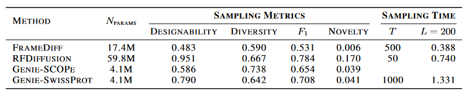
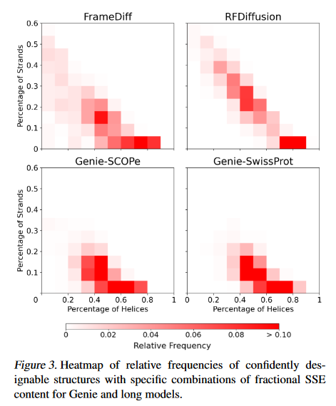
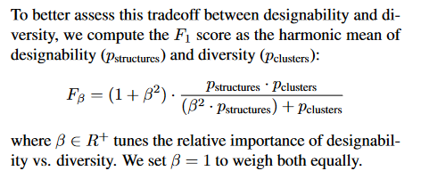

## Genie De Novo Protein Design by Equivariantly Diffusing Oriented Residue Clouds

这篇文章的方法简单有效

之前的方法要构建C-alpha的旋转矩阵的话，需要构建SE(3)或者SU(2)的扩散模型，十分复杂。然后这篇文章通过利用Frenet-Serret frames，就可以根据C-alpha的坐标生成对应的旋转矩阵，也就是说只需要找到C-alpha即可，那么又回到了传统的ddpm模型。

### Intro

Generative modeling trilemma

- quality
- mode coverage
- sampling time

其实intro没讲啥，就是引入了一种新的建模方式（cloud，其实就是旋转矩阵+平移向量）achieve sota

### Method

FS frames构建过程如下，可以看到只需要输入序列C-alpha的坐标就好

**模型**

看上去就是AF2的structure module（不过这篇文章画这么大的模型图真的合适吗？又不是重点）

**训练**

其实就是ddpm的目标函数，不过code中用的是RMSD计算距离

### Results

#### Comparison with short models （50-128）

**Designability**

方法：Genie采样得到的结构->8条ProteinMPNN生成序列（temperature=0.1）-> OmegaFold（或者ESMFold）预测结构，和采样的结构算TM-score

| Metric            | Genie | ProtDiff     | FoldingDiff   |
| ----------------- | ----- | ------------ | ------------- |
| scTM>0.5          | 81.5% | 5.1% (11.8%) | 19.6% (22.7%) |
| scTM>0.5&pLDDT>70 | 58.3% | 3.2%         | 17.7%         |

**Diversity**

1. 看secondary structure elements（用P-SEA识别二级结构）

对所有scTM>0.5&pLDDT>70的蛋白质，画出其二级结构的分布，发现Genie分布最diverse

2. 看一个蛋白质和confident domain上的蛋白质的最高TM-score（越小说明越diverse）

| Metric           | Genie | ProtDiff     | FoldingDiff   |
| ---------------- | ----- | ------------ | ------------- |
| maximum TM-score | 0.561 ± 0.086 | 0.583 ± 0.115 | 0.668 ± 0.178 |

**Novelty**

算和training set中的maximum TM-score

| Metric               | Genie | ProtDiff | FoldingDiff |
| -------------------- | ----- | -------- | ----------- |
| maximum TM-score<0.5 | 21.5% | 4%       | 20.3%       |

（这里看上去其实Genie生成的很大一部分蛋白质都是跟training set中一致的，怀疑过拟合了，也只比FoldingDiff好一点）

#### Comparison with short models （50-256）

和RFdiffusion，FrameDiff比

**Designability**

ProteinMPNN+ESMFold: scRMSD<2 and pLDDT<70

**Diversity**

看下二级结构分布。（看上去FrameDiff和RFDiffsion好像更好）

并且考虑三级结构的diversity，给所有的可设计蛋白质结构聚合（根据TMscore>0.6）

**Novelty**

对比PDB中的蛋白质，如果scRMSD<2 and pLDDT>70 and Maximum TM <0.5则认为是novel

### 结论

说实话采样真的很慢很慢。。

其实是被RFdiffusion吊打的，但是可以说RFdiffusion是pretrain过的，但是Genie是从头开始训练的