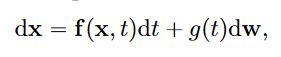

# SCORE-BASED GENERATIVE MODELING THROUGH STOCHASTIC DIFFERENTIAL EQUATIONS

## Score based generative modeling with SDEs

diffusion process可以被表述为以下形式 

reverse-time SDE可以被表述为以下形式（可以看到需要知道分布分数s_theta）

### estimating scores for the SDE

和SMLD那篇文章一样，用denoising score matching的方式训练：

### VE,VP SDEs and Beyond

这里讲了SMLD,DDPM和SDE的关系（SMLD和DDPM可以看作离散的SDEs的两种不同模式）。

对SMLD（Variance Exploding SDE）：

对DDPM（Variance Preserving SDE）：

## Solving the reverse SDE

作者提出了三种采样方式

### general-purpose numerical SDE solvers（reverse diffusion samplers）

DDPM的采样方法

被称之为祖先采样（ancestral sampling），而作者提出了reverse diffusion samplers

可以证明，ancestral sampling，当beta_i趋近于0的时候，可以转化为reverse diffusion samplers的形式

### Predictor-corrector samplers

### probability flow

对于每个SDE，存在一个确定性的diffusion过程：ODE

ODE速度更快但是生成的质量较差。

## controallable generation

懒得看了