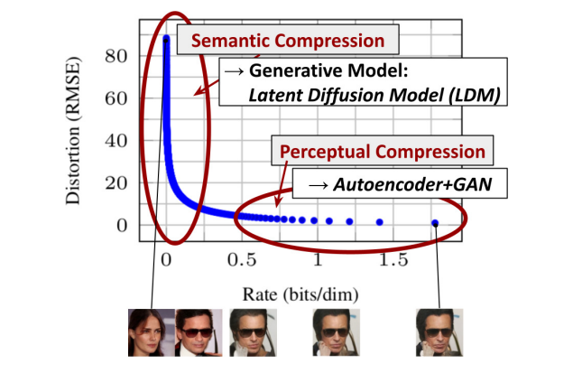
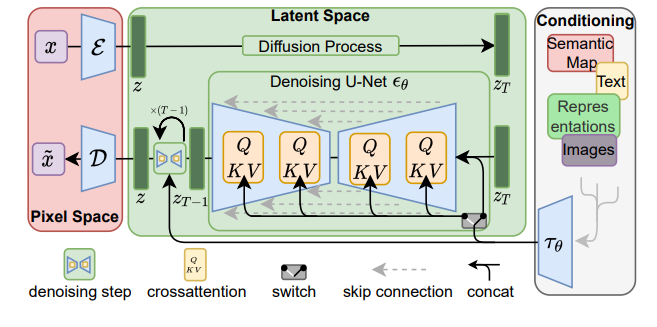
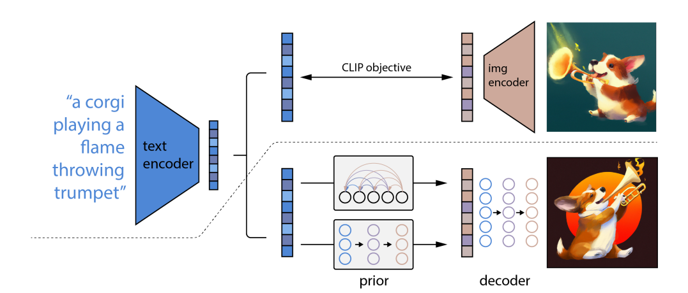

paper list

- stable diffusion
- dalle 2

## High-Resolution Image Synthesis with Latent Diffusion Models

stable diffusion; CVPR2022 

### Motivation

Diffusion太慢了，不论是训练还是采样。于是他们提出一种在隐空间使用diffusion process的方法，减少了计算资源的使用。

### Introduction

对diffusion来说，普通人真的用不起（目前最强大的diffusion model需要150-1000V100 days训练），并且采样也需要花费大量时间（产生50k图片需要在一张A100上跑5天）。而只在隐空间使用diffusion process可以很好的解决这个问题（把3\*H\*W降维到C\*H/d\*W/d）

而怎么把图片映射到隐空间（再映射回来）呢？作者首先分析了压缩方法。见下图，对autoencoder和gan来讲，其对样本的压缩更多是感知上的，而对于LDM来讲，其更多在于语义上。（我理解感知即比较high-level的，high-frequency的信息，而语义更在乎细枝末节）。因此我们其实不需要很多语义上的信息，并且希望保留感知上的信息，于是VAE就是一个很好的选择。

### Method

方法比较简单，不同的condition都是用相同的方法：经过一个encoder得到embedding，然后用cross-attention的方法把信息注入到U-Net中。目标函数与ddpm是一致的。

### 一些思考

对蛋白质领域而言，要根据这篇文章做一篇类似的有几个困难

1. Diffusion太慢，这个motivation在protein这边不好立足（现在protein backbone generation倒没有说很费GPU）。
2. 这里的VAE换成什么比较好？可以是foldseek，但是又要考虑失真的问题（也就是上面文章提到的感知和语义压缩trade-off）
3. 对蛋白质结构而言，是否有类似上图一样的感知和语义压缩的事情？

## Hierarchical Text-Conditional Image Generation with CLIP Latents

dalle 2; openai

这篇文章的特点就是，相对其他方法，其condition并不是直接的text embedding，而是通过CLIP学了一个逆向的 CLIP image encoder（他称之为prior），然后condition在这个prior输出的image embedding上。

其他似乎没什么了。这篇文章感觉更像是技术报告，很符合OpenAI的风格。其文中设计很多实现细节而较少提及motivation，只是在后面用ablation study证实了自己的方法是最优的（包括为什么要用prior他也说了，也跑了不用prior的实验，生成的图片会模糊很多）。